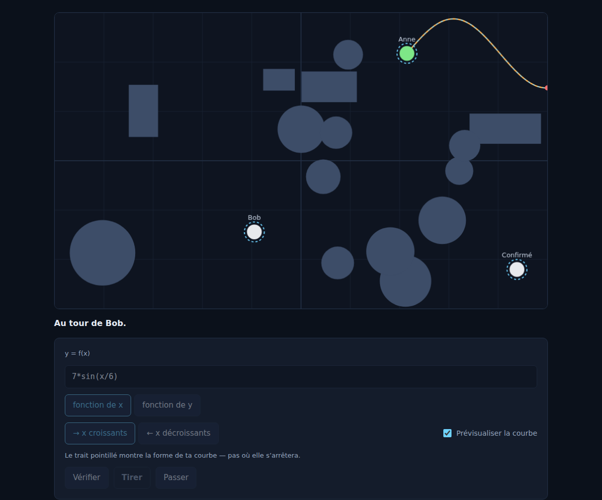
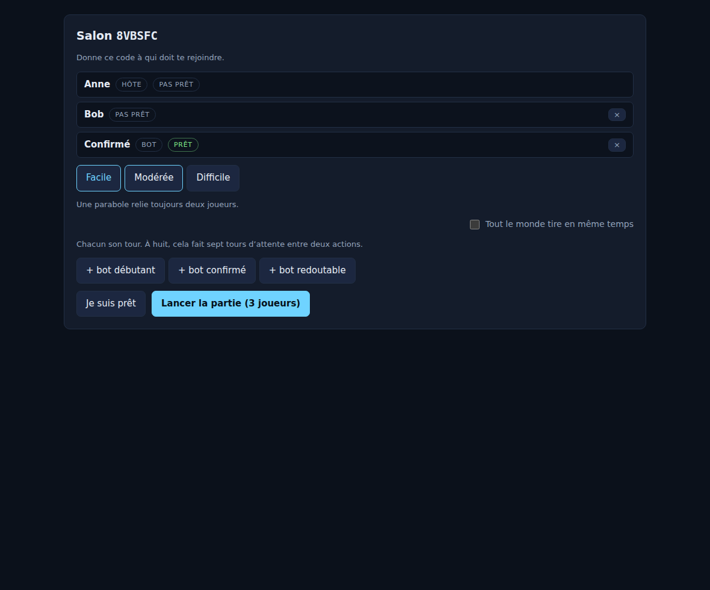

# FunctionWars

Un jeu au tour par tour, de deux à huit joueurs, où l'on s'élimine en
traçant des courbes.

À son tour, un joueur écrit une fonction — `x^2`, `3*sin(x/2)`, `ln(x+4)`, ou
une fonction par morceaux — choisit l'axe (`y = f(x)` ou `x = f(y)`) et un sens
de propagation. La courbe part de son point, contourne ou percute les obstacles,
et si elle traverse un adversaire, celui-ci disparaît. Dernier survivant gagné.

La seule règle imposée aux fonctions est qu'elles soient **continues** là où
elles sont tracées. Tout le reste — asymptotes, sorties de domaine, bords de
carte — arrête simplement le tir.



## État

**Phase 6 : le jeu est complet.** Serveur, salons, interface, bots, rejeux,
équilibrage mesuré.

```bash
pnpm install && pnpm run typecheck
pnpm run serve                   # terminal 1 : serveur WebSocket, port 8787
pnpm --filter @fw/client dev     # terminal 2 : http://localhost:5173

pnpm run hotseat                         # ou une partie à deux sur un clavier
pnpm run demo --seed bravo --f "x^2/40"  # ou un seul tir, pour regarder le tracé
```

Ce qui marche : écrire une fonction de `x` ou de `y`, se la voir refuser en
français sans perdre son tour si elle est discontinue ou mal formée, la voir
tracée sur une carte générée à la difficulté choisie par l'hôte, toucher, être
éliminé, gagner.

On peut jouer seul : l'hôte ajoute des bots au salon, à trois niveaux, et ils
prennent leur tour sans qu'on leur demande.

Une partie terminée se télécharge en quelques kilo-octets et se regarde à
nouveau, tour par tour.

L'hôte peut aussi passer la partie en **résolution simultanée** : chacun écrit
sa fonction, puis tout se résout d'un coup — deux joueurs qui se touchent
meurent tous les deux.



Le salon. L'hôte règle la difficulté du terrain, ajoute des bots, et voit qui
est prêt.

Ce qui reste ouvert est listé à la fin de [`TASKS.md`](TASKS.md).

## Installation

```bash
corepack enable          # pnpm 10, Node 22
pnpm install
pnpm run check           # format, lint, typecheck, tests
```

## Commandes

| Commande             | Rôle                                                              |
| -------------------- | ----------------------------------------------------------------- |
| `pnpm run check`     | Tout : format, lint, typecheck, tests. C'est ce que la CI exécute |
| `pnpm run typecheck` | `tsc --build` sur l'ensemble des paquets                          |
| `pnpm run lint`      | ESLint avec les règles typées                                     |
| `pnpm run test`      | Vitest, unitaires et propriétés                                   |
| `pnpm run format`    | Prettier en écriture                                              |
| `pnpm run balance`   | Campagne d'équilibrage : des bots jouent, un tableau sort         |

## Les paquets

| Paquet                                | Rôle                                              | Pur |
| ------------------------------------- | ------------------------------------------------- | --- |
| [`@fw/contracts`](packages/contracts) | Types, schémas réseau, ports, erreurs, constantes | ✅  |
| [`@fw/core-math`](packages/core-math) | Parseur, AST, évaluation, domaine, continuité     | ✅  |
| [`@fw/physics`](packages/physics)     | Tracé adaptatif, collisions, cartes               | ✅  |
| [`@fw/rules`](packages/rules)         | État de partie, tours, modes, victoire            | ✅  |
| [`@fw/bot`](packages/bot)             | Choix d'un tir pour un siège vide                 | ✅  |
| [`@fw/server`](packages/server)       | WebSocket, salons, sessions, orchestration        | —   |
| [`@fw/client`](packages/client)       | Canvas, saisie, salon, animations                 | —   |

« Pur » signifie : aucune dépendance vers le réseau, le DOM, le système de
fichiers ou l'horloge. Ces quatre paquets se testent intégralement en mémoire.

## Documentation

| Document                                           | Contenu                                                 |
| -------------------------------------------------- | ------------------------------------------------------- |
| [`AGENTS.md`](AGENTS.md)                           | Les règles permanentes pour quiconque code ici          |
| [`docs/ARCHITECTURE.md`](docs/ARCHITECTURE.md)     | Paquets, flux de données, dépendances                   |
| [`docs/GAME_DESIGN.md`](docs/GAME_DESIGN.md)       | Règles détaillées, grammaire des fonctions, équilibrage |
| [`docs/PROTOCOL.md`](docs/PROTOCOL.md)             | Messages réseau et machine à états                      |
| [`docs/DEPLOYMENT.md`](docs/DEPLOYMENT.md)         | Construire, servir, mettre derrière un proxy            |
| [`docs/AGENT_WORKFLOW.md`](docs/AGENT_WORKFLOW.md) | Prendre une tâche, brancher, ouvrir une PR              |
| [`docs/adr/`](docs/adr)                            | Les décisions structurantes et leurs raisons            |
| [`TASKS.md`](TASKS.md)                             | Le backlog, découpé par agent, avec ses dépendances     |

## Licence

Propriétaire, tous droits réservés.
